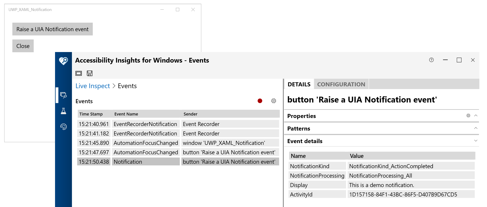

# UWP_XAML_Notification

This tiny demo app exists only to show the action taken by a UWP XAML app when it wants to raise a UI Automation (UIA) Notification event. An app would do that when it believes it would be helpful to customers using screen readers to have a specific message announced in some situation. Great care must be taken when considering whether a Notification event should be raised, as raising many unhelpful messages can result in the customer experience becoming unusable.

For more information about raising the event, and the event itself, please visit [RaiseNotificationEvent](https://docs.microsoft.com/en-us/uwp/api/windows.ui.xaml.automation.peers.automationpeer.raisenotificationevent?view=winrt-19041).

The screenshot below shows the Accessibility Insights for Windows tool reporting that the demo app has raised a UIA Notification event. The UIA element raising the event has a UIA Name property of "Raise a UIA Notification event", and the text supplied through the event is "This is a demo notification".

For more information about the Accessibility Insights for Windows tool, please visit [Accessibility Insights for Windows](https://accessibilityinsights.io/docs/en/windows/overview/).

